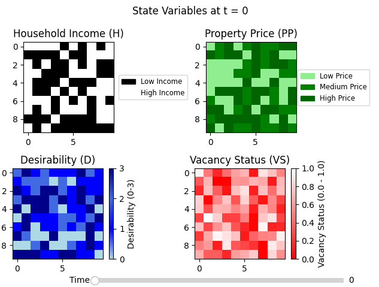
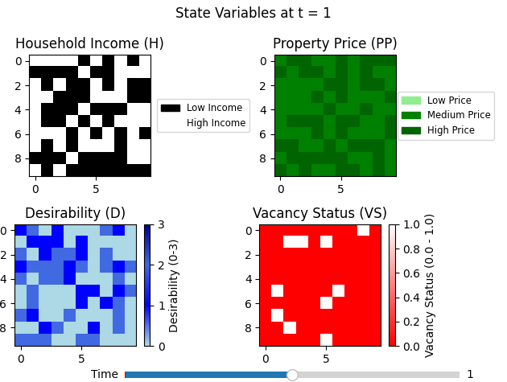
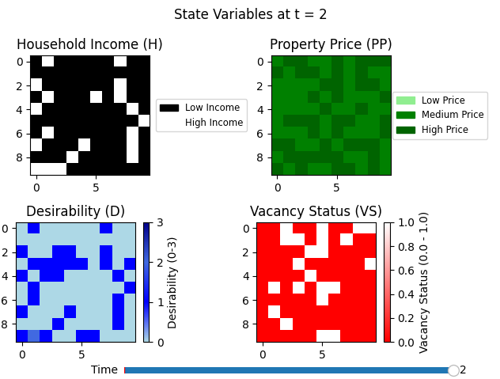
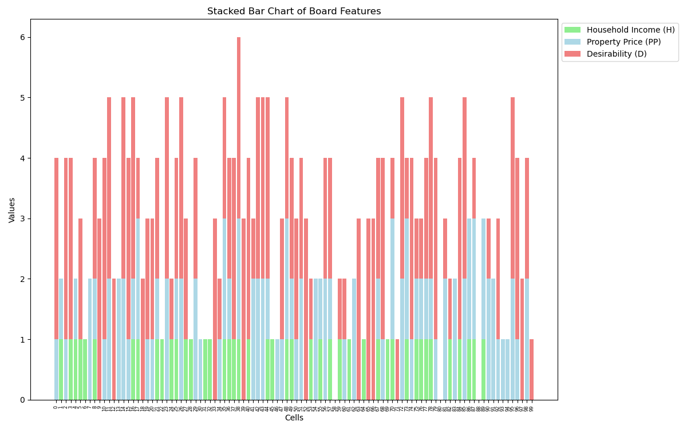

# Modeling Gentrification Process

This project simulates the process of gentrification using a Cellular Automata (CA) model. The model tracks changes in household income, property prices, desirability, and vacancy status over time, providing valuable insights into urban dynamics.

---

## Table of Contents

- [Checkpoint 2 Progress](#checkpoint-2-progress)
  - [Time-Step Visualization](#time-step-visualization)
  - [Testing](#testing)
  - [Visualization Cleanup](#visualization-cleanup)
  - [New Graph Implementation](#new-graph-implementation)
- [Checkpoint 2 Division of Labor](#checkpoint-2-division-of-labor)
- [Remaining Tasks](#remaining-tasks)
- [Updated Git Repository](#updated-git-repository)

---

## Checkpoint 2 Progress

### Time-Step Visualization

We have updated the framework to store each time step in the `HISTORY` variable. Using a slider widget from matplotlib, we created a discrete timeline that allows users to scroll forwards and backwards through the simulation and visualize changes in state variables (`H`, `PP`, `D`, `VS`) over time. The following figure shows the evolution of property prices, desirability, and vacancy levels over multiple timesteps.

    
    
    

### Testing

#### Whole-Run Testing
The `HISTORY` variable accurately records all changes during the simulation. This is crucial for debugging and analyzing results as it provides a complete record of the board’s state at each time step. Tests confirm:
- Each call to `update()` appends a copy of the board's state to `HISTORY`.
- The `terminate()` function adds the final state, even if no updates occur.

Unit tests for this functionality can be found in `classes/TestHistoryValidation.py`.

---

### Visualization Cleanup

To improve clarity, we updated visualizations with:
- Legends, labels, and a consistent color scheme for cell states.
- Heatmaps showing changes over time (e.g., `t=0`, `t=1`).

These updates enhance the readability and allow better tracking of features like household income, property price, desirability, and vacancy status throughout the simulation.

---

### New Graph Implementation

We introduced a new stacked bar chart to track the distribution of cell features over time. This macro-level view helps observe how the distribution of cell states evolves, enabling the identification of trends and patterns. Below is an example visualization:

The graph relies on data from the `HISTORY` variable to count cell states and track changes over time.

## Remaining Tasks

Our progress so far includes:
- Testing and visualization of results.
- A working CA model initialized with random data.

### Next Steps:
- Switch from a randomly initialized grid to a grid based on predefined formulas for increased accuracy.
- Document group contributions.
- Create a video to explain our work and results.

---

## Updated Git Repository

The updated code repository, including Checkpoint 2 progress, is available at:

[https://github.gatech.edu/ssamal31/Modeling-Gentrification](https://github.gatech.edu/ssamal31/Modeling-Gentrification)
